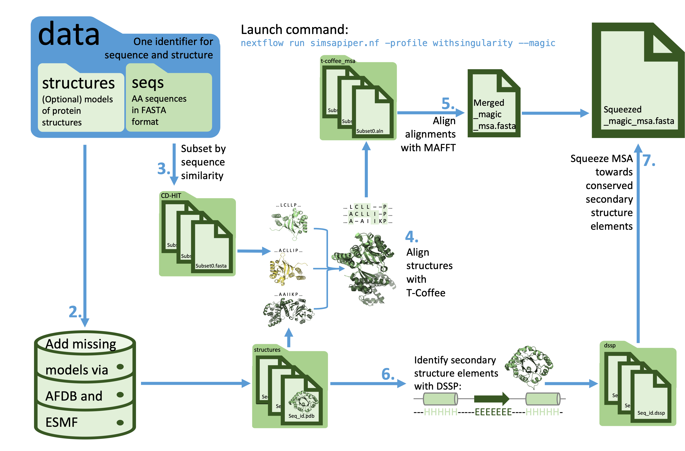
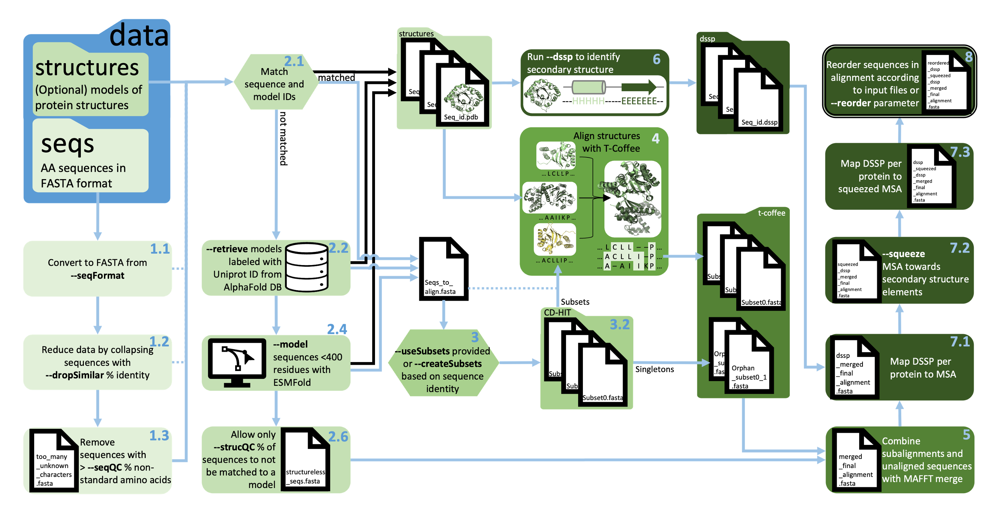

# SIMSApiper

SIMSApiper is a nextflow pipeline that enables users to create structure informed multiple sequence alignments simply from a set of protein sequences.
Structural information may be provided by the user or directly retrieved by the pipeline (AlphaFold Database or ESMFold). 
The process is significantly sped up by using sequence identity-based subsets and aligning them in parallel. 
Conserved secondary structure elements are used to reduce gaps for a high-quality final alignment.

# QuickStart


### Install requirements

- [Nextflow](https://www.nextflow.io/docs/latest/getstarted.html)
- [Singularity](https://apptainer.org/admin-docs/master/installation.html#installation-on-linux)/Apptainer or [Docker](https://docs.docker.com/get-docker/)
- Sufficient amount of scratch space and RAM (50 Sequences of 400 residues with 60% sequence identity need 30GB disk space and 10GB RAM)
- Copy of this repository
  ```
  git clone https://github.com/Bio2Byte/simsapiper.git
  ```

### Prepare data

Use directory `toy_example` to test installation.
SIMSAPiper will automatically recognise directories called `data` if none is specified.
The directory contains:

- Subdirectory `seqs` with fasta-formatted protein sequences
- Optional: subdirectory `structures` with 3D protein structure models

### Launch pipeline using command line

Enable recommended settings using **--magic**
```
nextflow run simsapiper.nf -profile server,withsingularity --data toy_example/data --magic --squeeze "H,G,E" --minSubsetID 20
```
or use 
```
./toy_example_launch_file.sh
```
This file can also be double-clicked to run the toy_example dataset.

By default most flags are set to False. 
Adding a flag to the command line will set it to True and activate it. 
Some flags can carry additional information, such as percentages or filenames.
The complete list can be found below.

**--magic** flag is equivalent to

```
nextflow run simsapiper.nf 
    -profile server,withsingularity 
    --seqFormat fasta
    --seqQC 5
    --droplSimilar 90
    --outFolder "simsa_time_of_execution"
    --outName "magicMsa"
    --minSubsetID "min"
    --createSubsets 30
    --retrieve
    --model
    --strucQC 5
    --dssp
    --squeeze "H"
    --squeezePerc 80
    --reorder
```

# Available flags

| Flag | Function | Default	| Recommendation | 
| ------ | ----------- |--- | ----------- |
| -resume | Retry the last run, no rerun of completed jobs  <br> -resume [hash] to retry specific run | | | 
| -profile standard	| Local execution <br> Use multiple profiles: -profile server,withconda |  |  | 
| -profile server	| Linux server execution	 |  |  | 	
| -profile hpc	| HPC execution using SLURM		 |  |  | 
| -profile withdocker	| Dependencies via docker container		 |  |  | 
| -profile withsingularity	| Dependencies via apptainer images		 |  |  |  | 
| -profile withconda	| Dependencies via conda (except T-Coffee)	 |  |  | 	
| --condaEnvPath	| Path to conda environment  (if –profile withconda) |   false | create  with .yml file for <br>ARM-Apple (-profile standard)/<br> Linux (-profile server) automatically |  
| --data	| Path to data directory 	 | data	 |    | 
| --structures	| Path to structure files directory  | **--data**/structures	 | | 
| --seqs	| Path to sequence files directory  | **--data**/seqs	 |  | 
| --seqFormat	| Input sequence format according to biopython <br>  Find all possible [formats](https://biopython.org/wiki/SeqIO) | 	fasta	 |  | 
| --seqQC	| Ignore sequences with % non-standard amino acids	 | 5	 | | 
| --dropSimilar 	| Collapse sequences with % sequence identity	| false	 | 90 | 
| --outFolder	| Set directory name for output files	 | results/simsa_time_of_execution	 |  | 
| --outName 	| Set final MSA file name	| 	finalmsa |   | 
| --createSubsets	| Creates subsets of maximally % sequence identity	 | false	 | 30 | 
|--minSubsetID | Sets minimal % sequence identity for sequences to be in a subset | 20 | "min" to collate smaller <br>   CD-Hit clusters|
|--maxSubsetSize | Sets maximal number of sequences in a subset | true | <400AA: --maxSubsetSize 100,<br> >400AA: --maxSubsetSize 50|
| --useSubsets	| User provides multiple sequence files corresponding to subsets <br> Provide sequences not fitting any subset in a file containing 'orphan' in filename  | false	 | | 
| --retrieve	| Retrieve protein structure models from AFDB  | 	false | 	 | 
| --model	| Predict protein structure models with ESM Atlas  | 	false | 	 | 
| --strucQC	| Maximal % of sequences not matched to a 3D structure | 	5	 |  | 
| --tcoffeeParams	| Additional parameters for Tcoffee 	 | false | "--help" | 
| --mafftParams	| Additional parameters for MAFFT 	 | false	 | "--localpair --maxiterate 100" | 
| --dssp	| Map DSSP code to alignment 	 | false | 	 | 
| --squeeze	| Squeeze alignment towards conserved 2nd structure elements <br>  Find all possible 2nd structure [elements](https://ssbio.readthedocs.io/en/latest/instructions/dssp.html) | false	 | "H,E" |
| --squeezePerc	| Set minimal occurence % of anchor element in MSA 	 | 80	 |  |  
| --reorder	| Order final MSA by input file order 	| false	 | "gamma.fasta,delta.fasta” <br>  “true” for alphabetical order  | 
| --convertMSA	| Covert final MSA file from fasta to selected file format	| 	false |  "clustal" | 
| --magic	| Launch a run with recommended settings for all parameters	 | false	 |  | 

# Documentation 

### Requirements
- [Nextflow](https://www.nextflow.io/docs/latest/getstarted.html) 
- Java V11
- Python3
- Sufficient amount of scratch space and RAM (300 Sequences of 400 residues with 30% sequence identity need 30GB disk space and 32GB RAM)

### Dependencies
- [Singularity](https://apptainer.org/admin-docs/master/installation.html#installation-on-linux)/Apptainer (-profile withsingularity)
	- Set common singularity image directory in nextflow.config
- [Docker](https://docs.docker.com/get-docker/) (-profile withdocker)
	- Start Docker before launching the pipeline
- Conda (-profile withconda)
	- Select Linux or ARM-Apple .yml file in nextflow.config 
	- Install T-Coffee, SAP and TMalign manually
- Local execution (-profile standard)
    Install
        - CD-Hit
	- MAFFT
	- Biopython
	- BLAST (V2.14)
	- Pandas
	- DSSP (Mac: V2.2 Linux: V3.0)
	- [T-Coffee](https://s3.eu-central-1.amazonaws.com/tcoffee-packages/Archives/T-COFFEE_distribution_Version_13.45.61.3c310a9.tar.gz) / [EasyBuild](https://github.com/vscentrum/vsc-software-stack/blob/site-vub/t/T-Coffee/T-Coffee-13.45.61.3c310a9.eb ) (V13.45.61.3c310a9)  
	- [TM-align](https://zhanggroup.org/TM-align/news.html) / [EasyBuild](https://github.com/easybuilders/easybuild-easyconfigs/blob/develop/easybuild/easyconfigs/t/TM-align/TM-align-20190822-GCC-11.3.0.eb ) (V20190822) 
	- [SAP](https://github.com/mathbio-nimr-mrc-ac-uk/SAP) / [EasyBuild](https://github.com/easybuilders/easybuild-easyconfigs/blob/develop/easybuild/easyconfigs/s/SAP/SAP-1.1.3-GCC-11.3.0.eb) (V1.1.3)

## Input files
### Launch file: `Magic_align.sh`

- Creates log file `*.nflog` with working directories for all subjobs, error messages, and execution hash for resuming
- Add more flags to standardise runs, alternatively create profiles in `nextflow.config` file

```bash
#!/bin/bash

#Adapt this line:
house=full/path/to/your/data/directory

#Adapt this line:
data=data_folder_containing_seqs_and_structures

now=`date +"%Y_%m_%d_%H_%M_%S"`

#Adapt this line:
output_name=${data}_${now}_description

output_folder=$house/results/$output_name
mkdir -p $house/results/
mkdir -p $house/results/$output

#Adapt here:
/path/to/software/nextflow run /path/to/simsapiper.nf \
	-profile select_infrastructure,select_container \
	--data $house/$data \
	--any_flag value_followed_by_\
	--magic \
	--outName magicMsa \
	--outFolder $output_folder \
	|& tee  $output_folder/run_report_$output_name.nflog
sessionName=$(sed -n '2s/.*\[\(.*\)\].*/\1/p' $output_folder/run_report_$output_name.nflog)

#Adapt this line:
/path/to/software/nextflow log | grep $sessionName >> $output_folder/run_report_$output_name.nflog

#remove all comment lines before launching
```

### Config file: `Nextflow.config`

- Holds all variables needed to adapt SIMSApiper to your system
- Local, server and HPC-SLURM execution profiles are prepared
- Edit to change standard parameters (as listed under available flags)
- Learn how to make nextflow profiles [here](https://www.nextflow.io/docs/latest/config.html?highlight=config) 

<!-- In this study, we execute Simsapiper on VSC Tier-2 general-purpose clusters provided by VUB-HPC, a member of the Vlaams Supercomputer Centrum (VSC). VSC is a collaborative effort among the five Flemish universities and their university associations, aimed at providing high-performance computing (HPC) resources to both the academic and industrial communities in Flanders. The infrastructure at VUB-HPC is based on CentOS v7 (Core) GNU/Linux distribution and is managed using the SLURM Workload Manager, which coordinates resource allocation and job scheduling across the clusters.
The compatibility of NextFlow with HPC environments is natively provided by this Workflow framework, therefore the execution of Simsapiper on VUB-HPC Tier-2 clusters is straightforward. Each step in the pipeline is translated by Nextflow into a SLURM job which allocates 1 CPU, 1 GB of RAM, and a 10-minute wall-time limit. However, it's important to note that steps involving T-Coffee require more extensive computational resources, so that, they request 10 CPUs, 15 GB of RAM, and a progressively increasing wall-time allocation (up to 2 hours for the first attempt, 8 hours for the second, and 64 hours for the final attempt).
Within the pipeline, NextFlow manages step dependencies, automating the dispatch of new SLURM jobs upon the completion of preceding steps. Additionally, it is possible to fine-tune the number of concurrently running jobs using specific configuration parameters defined in the NextFlow configuration file to optimize.

other profiles available on nf core
-->

### Sequence Input (--seqs)
Input: `data/seqs/` 

- Sequence file(s): 
    - One file with all sequences
	- Multiple sequence files (can be subsets for T-Coffee with **--use_subsets**)
- Sequence format:
    If not FASTA formatted, provide file format with **--seqFormat** according to biopython nomenclature 
- Sequence IDs: 
    If **--retrieve**: use Uniprot ID as sequence ID to enable retrieval from [AlphaFold Database](https://alphafold.ebi.ac.uk)


### Structural input (--structures)

Input: `data/structures/` 

- Structural input is optional
- Must be in .pdb format 
- Sequence labels and the structure filenames must match exactly! \
    \>P25106 will only match P25106.pdb
- Can be experimentally generated structures, from the PDB or modeled structures
- Squeezing (step 6) will fail if files contain more than one chain, large gaps, mutations
	- Extract a specific chain: [pdb-tools](http://www.bonvinlab.org/pdb-tools/)
	- Mutations in 3D structure will not impact MSA quality if mutations do not impact the overall organisation of the protein
	- Omit these issues by using predicted 3D models, even poor AlphaFold models have been [shown](https://doi.org/10.1093/bioinformatics/btac625) to improve the quality of MSAs
- Compute your own AlphaFold2 model using [ColabFold](https://colab.research.google.com/github/deepmind/alphafold/blob/main/notebooks/AlphaFold.ipynb) (very user friendly) or directly the [AlphaFold2](https://github.com/deepmind/alphafold) software instead of relying on [ESMFold](https://esmatlas.com/resources?action=fold) if
	- Proteins are very different from proteins previously solved in the PDB
	- Proteins are larger than 400 residues

### Output directory (--outFolder)

- Nextflow creates directory `results` in nextflow directory
- Every run creates a unique subdirectory
- Set name using **--outFolder**

### Output file name (--outName)

- Select name for the structure informed MSA using **--outName**

## 1. Preprocessing
### 1.1 Convert Sequence Files
Output: `results/outFolder/seqs/`

- Parse sequence files using [biopython](https://biopython.org/wiki/SeqIO) to provide sequences in fasta-2-line format 

### 1.2 Reduce dataset size ( --dropSimilar)
Output: `results/outFolder/seqs/CD-HIT/`

Why?

- Calculation time scales exponentially with number of input sequences 
- Recommendations:
	- 90% to remove redundant sequences
	- 70% to have a more general overview of the protein family and address sampling bias

How?

- Use [CD-Hit](https://github.com/weizhongli/cdhit) with high sequence identify cutoff (e.g. 90%)
- Keep cluster representatives 
- Proteins inside clusters will be excluded from the downstream processess
- Find in which cluster a specific protein is in `results/outFolder/seqs/CD-HIT/*.clstr` file

### 1.3 Quality control for input sequences (--seqQC)
Output: `results/outFolder/seqs/too_many_unknown_characters.fasta`

Why?

- Too many non-standard amino acids can result in a poor alignment

How?

- Remove all sequences containing more than **--seqQC** % non-standard amino acids

## 2. Match sequence with stucture information
### 2.1 Identify missing models

- Match sequence ID and structure model filenames 

Common Issues:

- Models not matched to a sequence present in input file can be caused by spelling or exclusion by **--dropSimilar** or **--seqQC**

### 2.2 Retrieve models from AlphaFold Protein Structure Database (--retrieve)
Output: `data/structures/uniprot_id.pdb`

Why?

- AlphaFold2 models are considered the most accurate protein structure predictions

How?

- Only possible if sequence ID is the Uniprot ID 

Common Issues:

- Entries in Uniprot that are not on the AlphaFold Database: generate model yourself (see tips in Structural input section )and add manually to `data/structures/` 

### 2.3 Identify missing models
(same as step 2.1)

### 2.4 Model Sequences with ESMFold (--model)
Output: `data/structures/sequence_id.pdb`

Why?

- Very fast prediction of novel protein structure models from sequence 
- No need to know the Uniprot ID

How?

- Submit sequence to ESMFold API for modelling, retrieve model on completion

Common Issues:

- Sequences are longer then 400 residues
- Sequence contains any characters not representing an amino acid
- API rate limit causes jobs to randomly fail: rerun SIMSApiper a few times to ensure maximal amount of models retrieved

### 2.5 Identify missing models
(same as step 2.1)

### 2.6 Assess number of structure models and sequences to be aligned (--strucQC)
Output: `results/outFolder/seqs/seqs_to_align.fasta`, `results/outFolder/seqs/structureless_seqs.fasta`

Why?

- Alignment quality decreases if too many sequences are not matched to a model

How?

- Job fails if more than **--strucQC** % of the sequences are structureless before starting the alignment step
- Sequences matched to a model: `seqs_to_align.fasta`
- Sequences not matched to a model: `structureless_seqs.fasta`

## 3. Subsetting - Division of the dataset in different subsets
Why?

- Calculation time and space requirements of T-Coffee alignments scale exponentially with number of sequences

How?

- Sequences shorter than 400 residues: maximally 100 sequences per subset
- Sequences longer than 400 residues: maximally 50 sequences per subset
- Sequences that do not fit a subset: label "orphan", not aligned with T-Coffee but with MAFFT based on sequence

### 3.1 User-provided subsets (--useSubsets)
Input: multiple sequence files in `data/seqs/`
Output: `results/outFolder/seqs/CD-HIT_for_t-coffee/*.fasta`

- Use phylogenetic relationships or sequence identity to manually create subsets
- Sequences that do not fit in a subset can be collected in one file with “orphan” in filename 
- Input for T-Coffee will be filtered for sequences matched to a protein structure model

### 3.2 Automatically generated subsets (--createSubsets)
Output: `results/outFolder/seqs/CD-HIT_for_tcoffee/subset*.fasta`

- Automatically cluster sequences with [PSI-CD-HIT](https://github.com/weizhongli/cdhit/wiki/3.-User's-Guide#user-content-PSICDHIT_clustering) **--createSubsets** % sequence identity into a subset
- Set appropriate maximum number of members per cluster based on sequence length **--maxSubsetSize**
- Singleton clusters will be labeled with “orphan“

Common Issues:

- Subsets are too large:
    - Increase initial clustering threshold **--createSubsets**
    - Clusters get split randomly to attain evenly distributed clusters smaller then **--maxSubsetSize** 
- More then 5% of the clusters are singletons:
    - Threshold will automatically decrease until **--minSubsetIdentity** (20%) iteratively
    - Set **--minSubsetIdentity "min"** to reduce overall number of subsets by collating small clusters until **--maxSubsetSize** reached
    
## 4. Run T-Coffee (--tcoffeeParams)
Output: `results/outFolder/msas/t-coffee/aligned_subset_*.aln `

Why?

- [Shown](https://doi.org/10.1038/msb.2011.75) to be the state-of-the-art structure-informed alignment method
- Combination of algorithms TMalign and SAP have [shown](https://doi.org/10.1093/bioinformatics/btac625) to provide the best results 

How?

- Each subset is aligned individually by T-Coffee 
- This is the step that takes the longest (likely hours) but can run in parallel depending on available resources
- In **-profile hpc**, each subset is submitted up to 3 times with [dynamically increasing resource requests](https://www.nextflow.io/docs/latest/process.html#dynamic-computing-resources) to minimize queue time
- Subsets labelled “orphan” will not be aligned with T-Coffee but added to the structure informed MSA with MAFFT based on their sequence
- Temporary files will be created in `work/.t_coffee/tmp/tco/`
- T-Coffee parameters in this pipeline: 
```bash
t_coffee -in=subset_0.fasta  -method TMalign_pair
-evaluate_mode=t_coffee_slow  -mode=3dcoffee  -pdb_min_cov=1  -thread 0 
-outfile="output/t-coffee/subset_0_aligned.aln" 
``` 
(note that sap_pair is used by default by the 3DCoffee mode of T-Coffee)
- Append any other T-Coffee flag with **--tcoffeeParams “-quiet”**


## 5. Run Mafft (--mafftParams)
Output: `results/outFolder/msas/merged_finalmsa_alignment.fasta`

Why?

- Combine T-Coffee subalignments 
- Add orphan and/or structureless sequences

How?

- Mafft merge mode is conserving the subalignment structure, mainly adds gaps
- Mafft parameters in this pipeline: 
```bash
mafft --merge tableMAFFT.txt input > prefinalMSA.fasta
```
- Append any other mafft flag or alignment modes  with **--mafftParams “--localpair --maxiterate 100”**
- Find appropriate flags [here](https://mafft.cbrc.jp/alignment/software/algorithms/algorithms.html#GLE)


## 6. Run DSSP (--dssp)
Output: `results/outFolder/dssp/model_name.dssp`

- Translate structure models into 2D secondary structure nomenclature using the [DSSP codes](https://swift.cmbi.umcn.nl/gv/dssp/DSSP_2.html)

## 7. Improve MSA
### 7.1 Map DSSP to MSA
Output: `results/outFolder/msas/dssp_merged_finalmsa_alignment.fasta`

- Map [DSSP codes](https://swift.cmbi.umcn.nl/gv/dssp/DSSP_2.html) on sequences of the MSA, conserving the gaps.

Common Issues:
- Mapping fails if sequence of model and sequence do not match exactly (eg. structure file contains more than one chain, large gaps, mutations) : sequence is added to mapped alignment without being converted to its DSSP codes

### 7.2 Squeeze MSA towards conserved secondary structure elements (--squeeze)
Output: `results/outFolder/msas/squeezed_dssp_merged_finalmsa_alignment.fasta`

Why?

- MSA of unstructured or less conserved regions (e.g. loops) are usually very disperse

How?

- Identifying conserved secondary structure elements such as ɑ-helices and β-sheets with **--squeeze “H,E”**, and squeeze MSA towards these regions
- Select threshold for region to be considered 'conserved' with **--squeezePerc**

### 7.3 Map DSSP to squeezed MSA
Output: `results/outFolder/msas/dssp_squeezed_dssp_merged_finalmsa_alignment.fasta`

- Map [DSSP codes](https://swift.cmbi.umcn.nl/gv/dssp/DSSP_2.html) on sequences of the squeezed MSA, conserving the gaps.

## 8. Reorder MSA (--reorder)
Output: `results/outFolder/reordered_*_merged_finalmsa_alignment.fasta`

- Order MSA according to the order of sequences in the input files in alphabetical order or by user defined order **--reorder "gamma.fasta,delta.fasta”**

## 9. Convert MSA 
Output: `results/outFolder/seqs/converted_*_merged_finalmsa_alignment.fasta`

- Convert MSA using [biopython](https://biopython.org/wiki/SeqIO) from fasta-2-line format 

## Log files

### Sequence report
Output: `results/outFolder/sequence_report.text`

- Contains number of sequences
    - in the input files
    - excluded because invalid
    - matched to a protein structure model
    - not matched to a protein structure model
    - in the final aligned file


### Resource log
Output: `results/outFolder/nextflow_report_outName.html`

- Log file created by nextflow pipeline
- Shows execution times and resource usage per job

### Execution log
Output: `results/outFolder/run_id_time.nflog`

- Created ONLY when using the launch file
- Captures terminal output of nextflow pipeline for error tracing
- Captures unique execution hash and flags for resuming the specific job

# Tips, tricks and common issues

- Sequence labels and the structure filenames must match exactly!  
- Cancel a running Nextflow job: **Crtl + C**
- At the top and the end of the `*.nflog` file all your flag settings are reported. 
- Pipeline failed to complete:  
    - to rerun the last job: append **-resume** to the launch command 
    - to rerun a specific job: check the `*.nflog` files last line to get the unique hash 
        ```bash
        nextflow run simsapiper.nf -resume 9ae6b81a-47ba-4a37-a746-cdb3500bee0f 
        ```
    Attention: last state will be permanently overwritten 
- All intermediate results are unique subdirectory of the directory `work` \
    Find directory hash for each step in `*.nflog` 
- Run in the background: launch simsapiper in a [screen](https://gist.github.com/jctosta/af918e1618682638aa82) 
    ```bash
    screen -S nextflowalign bash -c ./magic_align.sh
    ```
    Hit **Crtl + A** and **Crtl +  D** to put it in the background
- Launch file does not work: 
    - try:
        ```bash
        chmod +x magic_align.sh
        ```
        and rerun.
    - check for spaces behind `\` in the launch file, there can not be any.
    - On MacOS, replace `|& tee` with `>>`  
- Modeling with ESMFold has low yield: 
    - Sequences longer than 400 residues cannot be modeled: try [ColabFold](https://colab.research.google.com/github/sokrypton/ColabFold/blob/main/beta/AlphaFold2_advanced.ipynb) to generate your own models
    - ESM Atlas was asked to model too many sequences at once, resume the job
-Random crash T-Coffee: 
    - Go to the T-Coffee log file to better understand the problem: find the work directory of the T-Coffee step in `*.nflog`
    - If the error contains "sap_pair error": it is very likely that one of the troublesome proteins mentioned in the T-Coffee log file has a ESMFold model in the data/structures folder. Sometimes, the ESMFold models can contain regions with very odd 3D structures (prediction error). The sap_pair algorithm of T-Coffee detects those and because of that, it makes the entire pipeline fail.
  	Suggestions to circumvent this:
    	- Retrieve the AF model of the protein from AFDB using the --retrieve parameter
    	- If the protein is not available on AFDB:
    		- Try [ColabFold](https://colab.research.google.com/github/sokrypton/ColabFold/blob/main/beta/AlphaFold2_advanced.ipynb) to generate your own model
     		- Remove the ESMFold model of the troublesome protein from the data/structures folder and set --model false; the protein will be added to the MSA purely based on sequence info
      		- Remove the troublesome protein from the data/seqs/*.fasta file; the protein is removed from the dataset 
- Learn how to adapt this pipeline using Nextflow [here](https://www.nextflow.io/docs/latest/basic.html)
 
