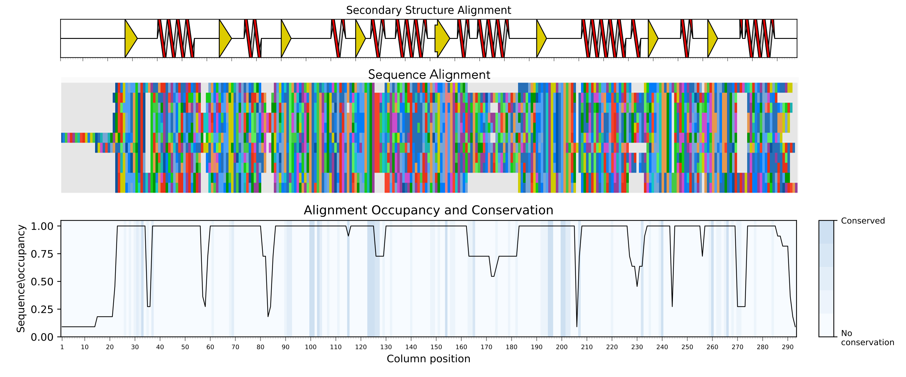

# SIMSApiper
[](https://doi.org/10.5281/zenodo.10854343) 

SIMSApiper is a Nextflow pipeline that enables users to create structure informed multiple sequence alignments simply from a set of protein sequences.
Structural information may be provided by the user or directly retrieved by the pipeline (AlphaFold Database or ESMFold). 
The process is significantly sped up by using sequence identity-based subsets and aligning them in parallel. 
Conserved secondary structure elements are used to reduce gaps for a high-quality final alignment.

Read more:
- [Protocols manuscript](https://github.com/Bio2Byte/simsapiper/blob/main/protocols_manuscript_september.pdf)
- [Wiki / Documentation](https://github.com/Bio2Byte/simsapiper/wiki)
- [Publication](https://doi.org/10.1093/bioinformatics/btae276)

# QuickStart


### Install requirements

- [Nextflow](https://www.nextflow.io/docs/latest/getstarted.html)
- [Singularity](https://apptainer.org/admin-docs/master/installation.html#installation-on-linux)/Apptainer or [Docker](https://docs.docker.com/get-docker/)
- Sufficient amount of scratch space and RAM (300 Sequences of 400 residues with 30% sequence identity need 30GB disk space and 32GB RAM)
- Copy of this repository
  ```
  git clone https://github.com/Bio2Byte/simsapiper.git
  ```

### Prepare data

Use directory `toy_example` to test installation.
SIMSAPiper will automatically recognize directories called `data` if none is specified.
The directory contains:

- Subdirectory `seqs` with fasta-formatted protein sequences
- Optional: subdirectory `structures` with 3D protein structure models

### Launch pipeline using command line

Enable recommended settings using **--magic**
```
nextflow run simsapiper.nf -profile server,withsingularity --data $PWD/toy_example/data --magic
```
or use 
```
chmod +x magic_align.sh
./magic_align.sh
```
This file can also be double-clicked to run the toy_example dataset.

Use absolute files paths (`/Users/me/workspace/simsapiper/toy_example/data`).

By default most flags are set to False. 
Adding a flag to the command line will set it to True and activate it. 
Some flags can carry additional information, such as percentages or filenames.
The complete list can be found in the [here](https://github.com/Bio2Byte/simsapiper/wiki/3-Available-flags).

**--magic** flag is equivalent to

```
nextflow run simsapiper.nf 
    -profile server,withsingularity
    --data $PWD/toy_example/data
    --seqFormat fasta
    --seqQC 5
    --dropSimilar 90
    --outFolder $PWD/simsa_time_of_execution
    --outName "magicMsa"
    --minSubsetID "min"
    --createSubsets 30
    --retrieve
    --model
    --strucQC 5
    --dssp
    --squeeze "H,E"
    --squeezePerc 80
    --reorder
    --data $PWD/toy_example/data
```

#### Other presets:

**--minimagic** to align small datasets (<50 sequences)

**--localmagic** to align datasets with predicting 3D structures locally using ESMfold

### Outputs
SIMSApiper provides outputs of all intermediate steps and provides some information of sequence conservation and alignment occupation and entropy in pdf and csv formats.
All outputs are described in our [wiki](https://github.com/Bio2Byte/simsapiper/wiki/4-Documentation).




# Citation

```bibtex
@article{crauwels_large-scale_2024,
	title = {Large-scale Structure-Informed multiple sequence alignment of proteins with {SIMSApiper}},
	issn = {1367-4811},
	doi = {10.1093/bioinformatics/btae276},
	pages = {btae276},
	journaltitle = {Bioinformatics},
	author = {Crauwels, Charlotte and Heidig, Sophie-Luise and Díaz, Adrián and Vranken, Wim F},
	date = {2024-04-22}
}
```
